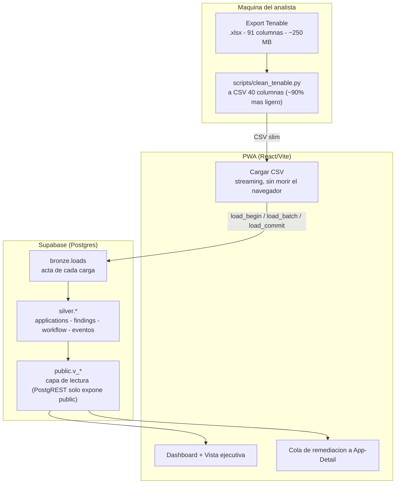
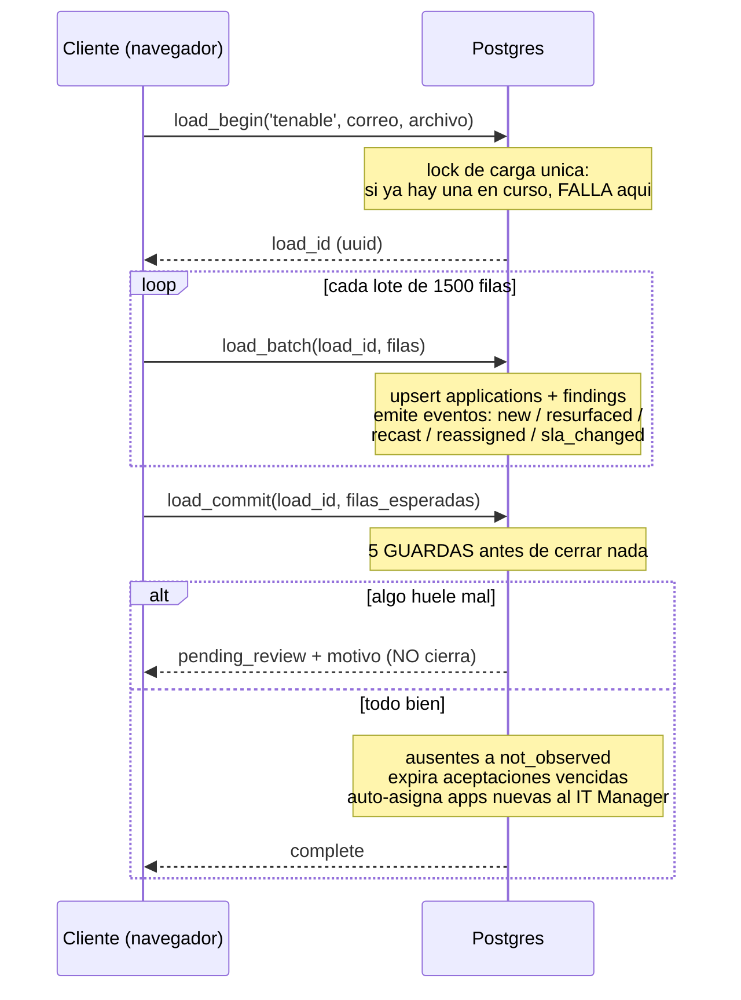

# Scotia · Reporter

Plataforma de **gestión de vulnerabilidades** app-céntrica para banca. Unifica los
escáneres (Tenable para infraestructura; Blackduck/Checkmarx/WebInspect para AppSec),
concilia cada carga con guardas de seguridad, prioriza por riesgo real, y da
**seguimiento de remediación por aplicación (APM)** con bitácora auditable.

El eje de todo es la **aplicación (APM/EPM)**: cada aplicación arrastra sus
vulnerabilidades, su dueño (IT VP → IT Manager), su riesgo, su SLA y su historial.

- **Front:** React + Vite + Recharts, tema oscuro Scotia.
- **Backend:** Supabase (Postgres + Realtime), esquemas `bronze` / `silver` / `public`.
- **Auth:** Supabase Auth. `anon` no alcanza ninguna tabla ni función — todo exige sesión.

---

## Índice

- [Los dos principios de diseño](#los-dos-principios-de-diseño)
- [Arquitectura](#arquitectura)
- [Ingesta de datos, de inicio a fin](#ingesta-de-datos-de-inicio-a-fin)
- [Modelo de datos](#modelo-de-datos)
- [El score de riesgo](#el-score-de-riesgo)
- [El front](#el-front)
- [Seguridad](#seguridad)
- [Cómo correrlo](#cómo-correrlo)

---

## Los dos principios de diseño

Todo el sistema descansa sobre dos ideas. Si algo parece raro, casi siempre es por una de estas.

### 1. Dos máquinas de estado que nunca se pisan — "el escáner manda"

```
ESCÁNER (la verdad)                 EQUIPO (la decisión)
lo escribe SOLO la ingesta          lo escribe SOLO la gente
open · resurfaced · fixed ·         sin_asignar · asignado · en_atencion ·
  not_observed                        bloqueado_torre · atendido
```

- El humano **nunca cierra la verdad**: solo afirma "atendido", y el próximo escaneo
  confirma o rechaza.
- La **discrepancia** (equipo dice `atendido`, escáner sigue viendo la vuln) es la
  señal estrella del producto, no un error a resolver.
- **Ausente ≠ remediado.** Que un hallazgo desaparezca del archivo no prueba que se
  arregló (pudo ser un escaneo sin credenciales). Pasa a `not_observed`, no a `fixed`.
  Solo `state=FIXED` explícito de Tenable cierra de verdad.

### 2. La aplicación (APM) es la entidad de primer nivel

Las suites comerciales emulan "aplicación" con tags que se pudren. Aquí el APM es una
tabla (`silver.applications`) con su árbol organizacional, y la remediación se asigna y
se sigue **por app**, no por cada uno de los ~63,600 hallazgos.

---

## Arquitectura



**Por qué 3 capas (medallion):**

| Capa | Qué es | Por qué |
|---|---|---|
| `bronze.loads` | El acta de cada carga: quién, cuándo, fecha del dato, filas, motivo si se frenó. | Auditoría e idempotencia. La verdad histórica de qué llegó y cuándo. |
| `silver.*` | El modelo normalizado: el APM como entidad, el hallazgo, el workflow, la bitácora. | Donde vive la lógica. Un solo lugar para el árbol org (no repetido 63,600 veces). |
| `public.v_*` | Vistas de lectura para el front. | **PostgREST solo expone `public`.** El modelo vive en silver; el front lee estas vistas. |

---

## Ingesta de datos, de inicio a fin

### Paso 0 — Limpieza local (`scripts/clean_tenable.py`)

El export real de Tenable es **xlsx de 91 columnas (~250 MB)**. El navegador **no puede
leer xlsx** (es un zip: habría que descomprimirlo entero en memoria, ~3–5 GB de pico).
Y 76% del peso son 7 columnas que la app no usa.

```bash
python3 scripts/clean_tenable.py "all data tanable.xlsx"
# -> all data tanable.slim.csv   (40 columnas, ~90% mas ligero)
```

El script:
- Deja las **40 columnas** que alimentan la app (incluye el árbol org: `IT VP`,
  `IT Manager`, `IT SVP`, `App Name`, `Tier`, `CIA`, `Usage`, `Managed By`…).
- **Aborta** si el export cambió de columnas (Tenable las renombró) o si vienen filas
  sin `id`.
- **Avisa** si `All APMs` trae varios valores (un host que sirve a varias apps).
- Usa `openpyxl` en modo `read_only` (streaming fila por fila) — por eso 250 MB es viable.

### Paso 1 — Carga por streaming (`src/lib/csv.ts` + `src/lib/ingest.ts`)

El CSV slim se sube desde la pestaña **Cargar CSV**. El parser es **incremental**
(`CsvParser`): lee el archivo por pedazos, arma cada fila, se queda con las 40 columnas
y tira el resto **al instante**. La memoria es O(lote), no O(archivo):

```
file.stream() -> decodifica por chunks -> parsea fila -> mapea -> sube lote de 1500 -> suelta
```

Pico de memoria: **~42 MB** para un CSV de 33 MB (contra ~745 MB de la versión que
cargaba todo de golpe). Sin Web Worker: como cada lote espera su RPC, el hilo principal
cede solo y la UI no se congela.

### Paso 2 — El motor de conciliación (Postgres)

Cada carga es una transacción lógica en tres actos:



**Las 5 guardas de `load_commit`** (por qué existe cada una):

| Guarda | Frena | Negociable |
|---|---|---|
| Filas declaradas ≠ registradas | Un lote se perdió a media carga | No (es un bug) |
| Cero filas ingeridas | El `curl` anónimo que intentaba cerrar todo | No |
| Fecha del dato < última carga | Subir el archivo del mes pasado encima del de este mes | No |
| Filas < 90% de la carga anterior | Un extracto filtrado disfrazado de universo completo | Sí, con `force` |
| Cierre > 10% del universo | Cerrar en masa por error | Sí, con `force` |

**Decisiones clave del motor:**

- **`scan_id` por carga (no timestamp):** el cierre de ausentes se hace por id de carga,
  no comparando relojes. Dos analistas cargando a la vez ya no se aniquilan.
- **`first_observed` nunca se pisa:** la fecha de nacimiento del hallazgo se preserva —
  es lo que mide la deuda de SLA real.
- **`durable_key` = `asset|plugin|port|protocol`:** el `id` de Tenable no sobrevive a que
  reimaginen un host; esta llave sí. Sin ella, reimaginar un servidor "borraría" la deuda.
- **`sla_days` viene del dato** (`Remediation time`: 15/30/120d), nunca hardcodeado.

### Paso 3 — Auto-asignación y triage

Al confirmar la carga, cada app nueva **se auto-asigna a su IT Manager** (es un JOIN, el
IT Manager es dato de la app). Los flags de triage por hallazgo (`falso_positivo`,
`riesgo_aceptado`) **están protegidos del reimport**: el mismo hallazgo que reaparece
conserva su disposición, no vuelve a salir como pendiente.

---

## Modelo de datos

### `bronze`
- **`loads`** — acta de cada carga: `load_id`, `state` (in_progress/complete/aborted/pending_review), `loaded_by`, `data_date`, `rows_seen`, `blocked_reason`.

### `silver`
- **`applications`** — el APM: `epm` (PK), `app_name`, `tier`, `cia`, `usage`, `exposed_internet`, `mx_regulatory`, `it_svp`, `it_vp`, `it_manager`, `contact_app`, `lob`, `pais`.
- **`findings`** — el hallazgo (estado actual): `finding_key` (PK), `durable_key`, `epm`, `asset`, `severity_scanner`, `vpr`, `status`, `first_observed`, `sla_days`, `kri_status`, `managed_by`, `es_falso_positivo`, `es_riesgo_aceptado`.
- **`finding_events`** — bitácora del ciclo del hallazgo (append-only): new/fixed/resurfaced/not_observed/recast/reassigned/…
- **`app_workflow`** — estado humano por app: `workflow_state`, `assignee`, `blocked_reason`, `commitment_date`, `priority`.
- **`app_workflow_events`** — bitácora del trabajo humano (assign/state/comment/due/watch).
- **`task_watchers`** — observadores por app (la torre se auto-agrega al bloquear).
- **`risk_acceptances`** — aceptación de riesgo con aprobador + expiración + controles.
- **`app_scans`** / **`project_epm_map`** — AppSec (grano por app) y el mapa PROJECT KEY → EPM.

### `public` (capa de lectura)
`v_findings` · `v_app_gestion` (la cola con risk score) · `v_discrepancia` ·
`v_workflow_log` · `v_app_watchers` · `v_risk_acceptances` · `v_org_tree` (cascada
VP→Manager→App) · `v_hidden_debt` · `v_recast_log` · `v_cross_layer` · `v_loads` ·
`v_activity`. Más las funciones `dashboard_metrics()` y `metricas_ejecutivas()`.

### RPCs
| Grupo | Funciones |
|---|---|
| Ingesta | `load_begin` · `load_batch` · `load_commit` · `load_abort` |
| Workflow | `wf_assign` · `wf_set_state` · `wf_comment` · `wf_set_due` · `wf_watch` |
| Triage | `fnd_false_positive` · `fnd_accept_risk` · `fnd_revoke_acceptance` · `expirar_aceptaciones` |
| Métricas | `dashboard_metrics` · `metricas_ejecutivas` |

---

## El score de riesgo

La cola de remediación se ordena por un **risk score 0–100 por app**, no por conteo de
críticos (eso produce "mar de rojo"). La fórmula es auditable:

```
score = criticidad_app x MAX(peso de hallazgos) x volumen_acotado x castigo_SLA
```

- **`MAX(peso)`, no promedio:** el peor hallazgo pone el piso. Cerrar un low nunca sube
  el score (el promedio lo hacía no-monótono).
- **`peso` = VPR de Tenable** (0.1–10) si viene, si no un fallback por severidad.
- **criticidad_app (1–5):** core-tier (+2) pesa más que exposición a internet (+1), más
  producción (+1), más regulatoria CNBV (+1).
- **volumen acotado** `least(1.6, count^0.15)`: más backlog pesa algo, con techo — 2,000
  lows no le ganan a 3 críticas.
- **castigo SLA** (×1 a ×1.8): un vencido crítico/high dispara +50%.

Basado en el patrón **AES de Tenable** (VPR × criticidad de activo) + el factor sublineal
de **Qualys TruRisk**.

---

## El front

| Pestaña | Qué es |
|---|---|
| **Dashboard** | Vista ejecutiva: tendencia nuevos-vs-remediados, % cumplimiento SLA, top apps que incumplen, MTTR, + gráficas por VP/Manager/severidad/antigüedad, filtrable en cascada IT VP → Manager → App. |
| **Hallazgos** | Explorador de la tabla de hallazgos con búsqueda y paginación. |
| **Gestión** | La cola de remediación por app (ordenada por risk score). Clic en una app → página **App-Detail** con 4 pestañas: **Seguimiento** (timeline + acciones), **Vulnerabilidades** (los hallazgos de la app + triage por fila), **Actividad** (historial completo), **Contactos** (cadena de escalamiento). |
| **Cargar CSV** | Ingesta por streaming con barra de progreso. |
| **Actividad** | El acta de cargas + la bitácora global. |

---

## Seguridad

Esta es data **sensible**: hostnames de PROD, CVEs sin parchar, cuáles están expuestas a
internet, y el nombre del responsable de cada una.

- **`anon` no alcanza nada.** Todas las tablas, vistas y funciones exigen `authenticated`.
  La anon key va en el bundle (es pública por diseño), pero sin permisos no sirve de nada.
- **`supabase/cerrar_puerta.sql`** revoca `anon` y tira las políticas abiertas — se corre
  una vez sobre una base que venga del modelo viejo.
- **RLS** activa en todas las tablas; políticas `for all to authenticated`.
- El techo de cierre de `load_commit` impide que una llamada suelta cierre el universo.

> ⚠️ El hosting es GitHub Pages **público**. El login protege los datos, pero para
> producción real esto debería vivir en hosting interno con RLS por rol (un IT VP ve solo
> sus apps — el modelo por APM lo hace natural).

---

## Cómo correrlo

```bash
npm install
cp .env.example .env     # VITE_SUPABASE_URL y VITE_SUPABASE_ANON_KEY
npm run dev              # http://localhost:5173
```

**Aplicar el esquema** en Supabase → SQL Editor: pega `supabase/schema.sql` completo. Es
**idempotente** (se puede reaplicar). Agrega `bronze` y `silver` a los *exposed schemas*
en Settings → API para que el realtime del acta funcione.

**Cargar datos:** pasa el xlsx de Tenable por `clean_tenable.py`, y sube el CSV resultante
desde la pestaña Cargar CSV.

---

## Expertos (`.claude/agents/`)

Dos agentes especializados para seguir iterando el diseño:
- **`vuln-mgmt-expert`** — modelo de estados, priorización, SLA, workflow (ServiceNow VR,
  Qualys TruRisk, Tenable One, Rapid7, DefectDojo, ClickUp).
- **`ui-redesign-expert`** — UI/UX para dashboards densos y herramientas de gestión.
